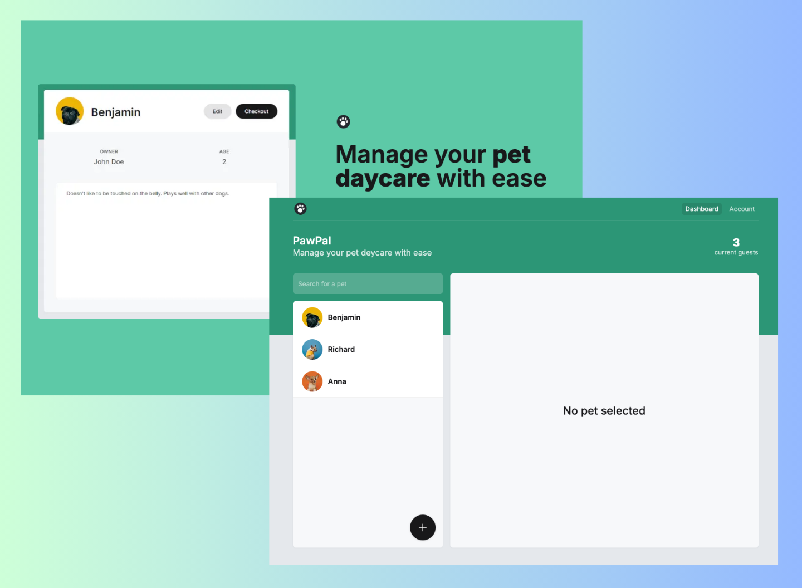

# PawPal - Daycare App For Your Pet 🐾

## 🚀 Features

- **Book Daycare Services**: Effortlessly schedule daycare services for your furry friends.
- **Manage Subscriptions**: Seamlessly handle subscription plans via Stripe integration.
- **Secure Payments**: Make payments easily and securely through Stripe.
- **Responsive Design**: Experience an optimized layout across all screen sizes.
- **Interactive UI**: Enjoy hover effects and visually appealing interactive elements.
- **User-Friendly Forms**: Validated forms ensure a smooth user experience with Zod and TypeScript.

## 🛠️ Technologies Used

- **Next.js**: Framework for fast and scalable web apps with SSR and static site generation.
- **Prisma**: Intuitive ORM for managing database interactions.
- **Stripe**: Simplified subscription and payment handling.
- **Neon Postgres**: High-performance cloud-based PostgreSQL database.
- **shadcn/ui**: Pre-built accessible components for a beautiful UI.
- **Tailwind CSS**: Utility-first CSS framework for rapid styling.
- **TypeScript**: Type-safe development for better maintainability.
- **Zod**: Schema validation to ensure robust and secure inputs.

## 🌐 Live Demo

[Live Demo](https://paw-pal-sepia.vercel.app/)

## 🌟 Lighthouse Score

  
    

## 🌄 Preview

  
    

## Author

- LinkedIn - [Gümrah Sindar](https://www.linkedin.com/in/gumrahsindar/)
